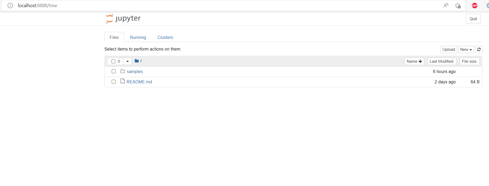

# Jupyter Notebook Sample for SmartIDE

### Repo Desc
This repository mainly show you SmartIDE'support for Python & DataScience. with this repo's .ide.yml config file, you can use SmartIDE launch a Jupyter Notebook environment just by one command:
```
smartide start
```


### After execute above command, you can get an online SmartIDE editor environment, it will auto launch a JupyterNotebook environment


### Then you can use your browser to open http://localhost:8888 to enter the JupyterNotebook and explore the samples



