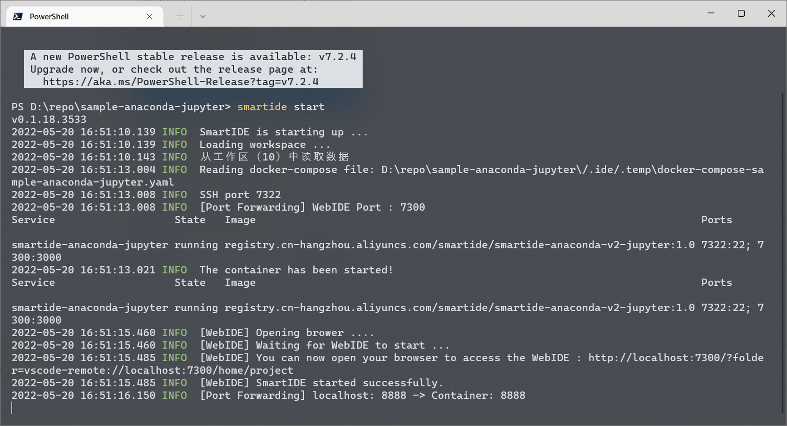

# Jupyter Notebook Sample for SmartIDE

## How to run this sample
This repository mainly show you SmartIDE'support for Python & DataScience. with this repo's .ide.yml config file, you can use SmartIDE launch a Jupyter Notebook environment just by one command:

### SmartIDE Start

```shell
## Use local docker
smartide start https://github.com/SmartIDE/sample-anaconda-jupyter.git
## Use a remote machine
smartide add <Ip-Address> --username <user> --password <pwd> --port <ssh-port | default 22>
smartide start --host <HostId> https://github.com/SmartIDE/sample-anaconda-jupyter.git
```



### After execute above command, you can get an online SmartIDE editor environment, it will auto launch a JupyterNotebook environment


### Then you can use your browser to open http://localhost:8888 to enter the JupyterNotebook and explore the samples


## COVID 19 Sample [Shanghai vs Beijing]

Date Range: 2022/3/22 - 2022/5/22

Shanghai Trend


Beijing Trend


Data from: Tencent News App 
API: https://api.inews.qq.com/newsqa/v1/query/pubished/daily/list?province={province}&limit={limit}


